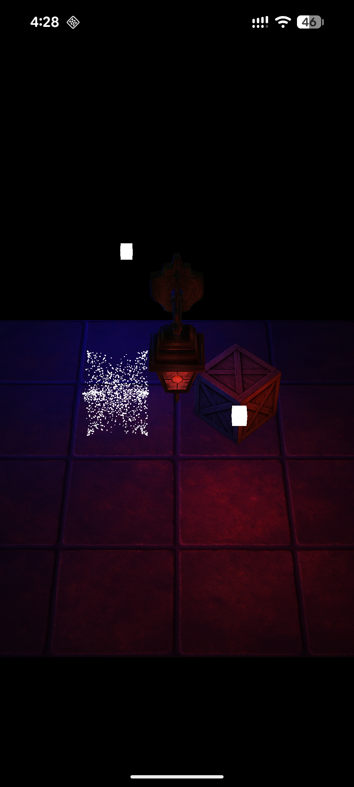
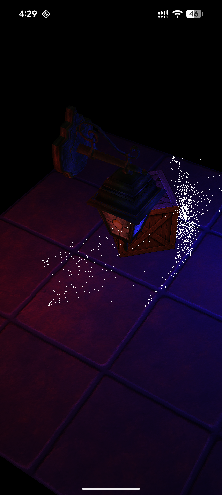
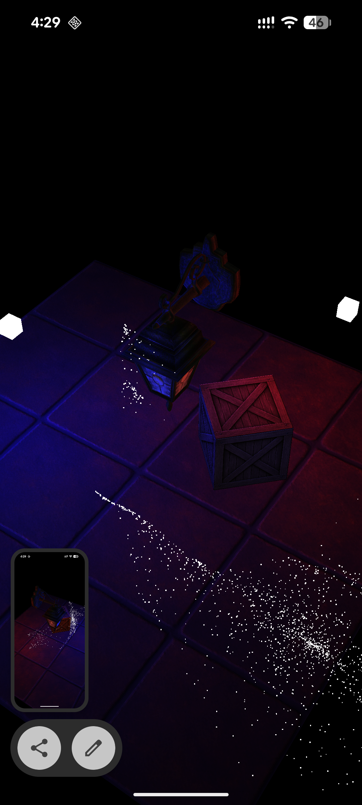
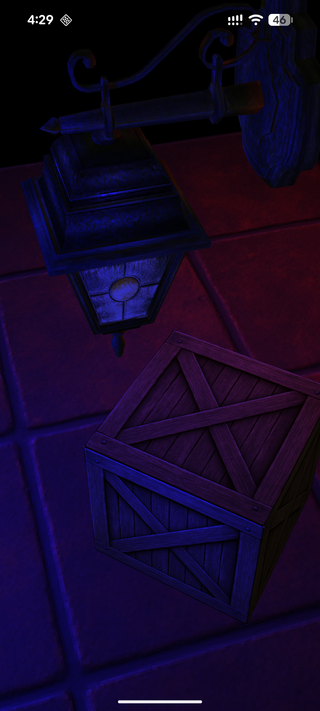

# Android NDK OpenGL ES 3.0 Demo

An Android application demonstrating real-time 3D rendering using **OpenGL ES 3.0** via the **Android NDK (C++)**. The project showcases a range of modern rendering techniques including lighting, stencil outlines, particle systems, off-screen rendering, and object picking.

---

## 📸 Screenshots

<p align="center">
  
  
  
  
</p>

---

## 📸 Features

- **3D Scene Rendering** – Cubes, a floor plane, and `.obj` model loading (lantern, Minecraft model)
- **Phong Lighting** – Diffuse + specular lighting with attenuation, supporting multiple light sources
- **Stencil Buffer Outlines** – Object selection highlight using the stencil buffer
- **Off-screen Rendering (FBO)** – Scene rendered to a framebuffer texture then composed onto a screen quad
- **Color ID Picking** – Touch-based 3D object selection using unique color IDs rendered off-screen
- **Particle System** – 2D particle effects attached to 3D objects
- **Line Drawing** – Dynamic 2D line rendering via touch input
- **Camera Controls** – Drag-to-rotate camera with aspect ratio support
- **Texture Mapping** – Diffuse + specular texture maps loaded via STB Image

---

## 🛠️ Tech Stack

| Layer        | Technology                              |
|--------------|-----------------------------------------|
| Language     | C++ (NDK), Kotlin                       |
| Graphics API | OpenGL ES 3.0 (`GLESv3`)                |
| Build System | CMake 3.22.1, Gradle (Kotlin DSL)       |
| Math Library | [GLM](https://github.com/g-truc/glm) 1.0.1 (via FetchContent) |
| OBJ Loading  | [tinyobjloader](https://github.com/tinyobjloader/tinyobjloader) v2.0.0rc13 (via FetchContent) |
| Image Loading | [STB Image](https://github.com/nothings/stb) (single-header) |
| Min SDK      | API 24 (Android 7.0)                   |
| Target SDK   | API 36                                  |

---

## 📁 Project Structure

```
app/src/main/
├── cpp/
│   ├── CMakeLists.txt              # CMake build config + dependency fetching
│   ├── GameRendererBridge.cpp      # JNI bridge for renderer lifecycle
│   ├── ResourcesBridge.cpp         # JNI bridge for asset/resource access
│   ├── assets/
│   │   └── AssetManager.cpp/.h     # Android asset file reading
│   ├── object_loader/
│   │   └── ObjectLoader.cpp/.h     # .obj model loader (tinyobjloader wrapper)
│   ├── image/
│   │   └── stb_image.h             # STB image loading (single-header)
│   └── game/
│       ├── GameRenderer.cpp/.h     # Main render loop (init, draw, events)
│       ├── GameWorldLogic.cpp      # Scene/game logic
│       ├── GameGLConfig.cpp        # OpenGL state configuration
│       ├── GameEventsHandler.cpp   # Touch/drag event routing
│       ├── camera/                 # Camera transform & projection
│       ├── environment/            # Scene environment (camera + lights)
│       ├── light/                  # Light + attenuation model
│       ├── screen/                 # FBO / off-screen render target
│       ├── objects/
│       │   ├── base/               # Base GL object (VAO/VBO setup)
│       │   ├── 3d/                 # 3D objects (GLObject, Cube, Plane, textures)
│       │   ├── 2d/
│       │   │   ├── particles/      # Particle system
│       │   │   └── ui/             # Line drawing
│       │   └── shaders/            # Shader program + uniform helpers
│       ├── uievents/               # Touch event state (TouchDown etc.)
│       └── utils/                  # OpenGL, shader, and math utilities
├── assets/
│   ├── models/                     # .obj 3D models (lantern, minecraft)
│   ├── shaders/                    # GLSL shaders (.vert / .frag)
│   │   ├── object_v.vert           # Main vertex shader
│   │   ├── object_f.frag           # Phong lighting fragment shader
│   │   ├── light_f.frag            # Light source fragment shader
│   │   ├── stencil_f.frag          # Stencil outline shader
│   │   ├── color_id_f.frag         # Color ID picking shader
│   │   ├── screen/                 # Screen quad shaders (FBO blit)
│   │   ├── line/                   # Line drawing shaders
│   │   └── particles/              # Particle shaders
│   └── textures/                   # PNG textures (diffuse + specular maps)
└── java/com/siradze/workingwithc/  # Kotlin entry point & JNI declarations
```

---

## 🚀 Getting Started

### Prerequisites

- **Android Studio** (Hedgehog or newer recommended)
- **NDK** installed via SDK Manager (any recent version)
- **CMake 3.22.1** installed via SDK Manager
- An Android device or emulator with **OpenGL ES 3.0** support

### Build & Run

1. Clone the repository:
   ```bash
   git clone https://github.com/your-username/android-ndk-opengl.git
   ```
2. Open the project in **Android Studio**.
3. Let Gradle sync and CMake fetch dependencies (`glm`, `tinyobjloader`) automatically.
4. Select a device/emulator and press **Run ▶**.

> **Note:** The first build may take a few minutes while CMake downloads and compiles the external libraries.

---

## 🎮 Controls

| Gesture       | Action                            |
|---------------|-----------------------------------|
| Drag          | Rotate the camera around the scene |
| Tap on object | Select / highlight the object (color ID picking) |
| Touch & drag  | Draw a line in the scene          |

---

## 🔦 Rendering Pipeline Overview

```
Touch/Input Events
       │
       ▼
  GameEventsHandler
       │
       ▼
  GameRenderer::onDrawFrame()
       │
       ├─► Bind FBO (Screen) ──► Draw scene objects ──► Unbind FBO
       │                          (Phong shading, stencil outlines,
       │                           lights, particles, lines)
       │
       ├─► Blit FBO to default framebuffer (screen quad)
       │
       └─► Color ID pass (off-screen) ──► Read pixel ──► Object selection
```

---

## 📦 Dependencies

All C++ dependencies are fetched automatically by CMake at build time:

| Library | Version | Purpose |
|---------|---------|---------|
| [GLM](https://github.com/g-truc/glm) | 1.0.1 | Linear algebra / matrix math |
| [tinyobjloader](https://github.com/tinyobjloader/tinyobjloader) | v2.0.0rc13 | .obj model parsing |
| [STB Image](https://github.com/nothings/stb) | (bundled) | PNG/JPEG texture loading |

---
